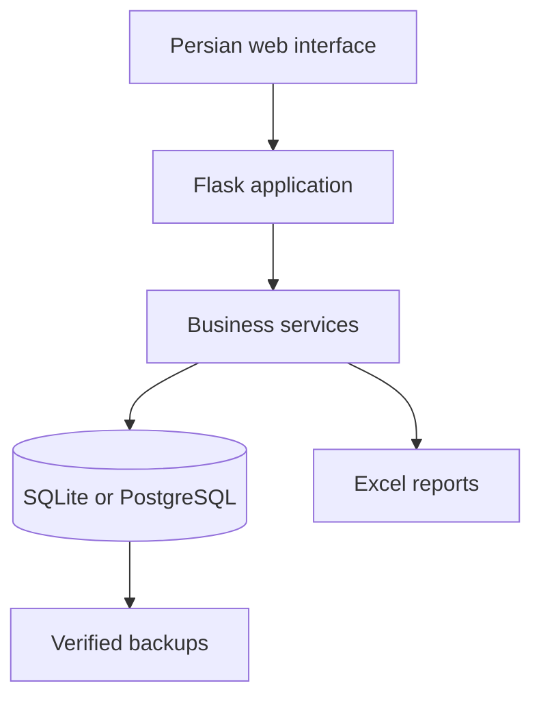

# Ganjineh

Ganjineh is a Persian-language inventory and order-management application designed for the day-to-day workflow of a small business. I developed it as a production-oriented system for coordinating products, customer orders, deliveries, factory orders, returns, stock reconciliation, reporting, and backups.

This public repository is a portfolio overview. The production source code, operational configuration, databases, backups, and customer information are maintained privately.

## What the system handles

- Products identified by factory and product code, with multiple size variants
- Customer orders and partial deliveries
- Factory orders and partial receipts
- Physical, reserved, available, shortage, and incoming inventory
- Returns, cancellations, and a stock-movement audit trail
- Multi-user authentication and administrator controls
- Jalali dates in the interface with standard dates in storage
- Date-range reports and formatted multi-sheet Excel exports

## Engineering focus

The main engineering challenge was preserving inventory consistency across interconnected workflows. An order, partial delivery, return, cancellation, or factory receipt can affect several stock measures, so these operations were designed around explicit transactional boundaries and auditable stock movements.

Reliability measures include:

- Transaction coordination for concurrent writes
- Row-level locking when PostgreSQL is used
- SQLite integrity triggers and WAL mode
- Idempotency tokens to prevent duplicate form submissions
- Verified SQLite backups using integrity checks
- Recent, daily, and monthly backup retention
- Pre-upgrade backups and schema migrations
- Controlled shutdown that blocks new writes before the final backup

## Architecture



## Technology

Python · Flask · SQLAlchemy · SQLite · PostgreSQL · Jinja · JavaScript · pytest · Docker · Nuitka

## Selected public example

[`examples/inventory_example.py`](examples/inventory_example.py) is a small, synthetic illustration of available, shortage, and projected-inventory calculations. It is intentionally independent of the production application and contains no customer information, database access, or deployment logic.

```bash
python examples/inventory_example.py
python -m unittest examples/test_inventory_example.py
```

## Validation

The private test suite covers core order and inventory workflows, Excel reporting, database upgrades, verified backups, duplicate-request protection, invalid-row rejection, login throttling, and concurrent inventory operations.

## Privacy and availability

- No real customer records, credentials, databases, or backup files are included publicly.
- Screenshots and demonstration material use synthetic information only.
- Production source and operational deployment instructions are maintained privately.

## Status

Version 2.2.0 is a stable production-oriented snapshot. A larger architectural upgrade is planned.
